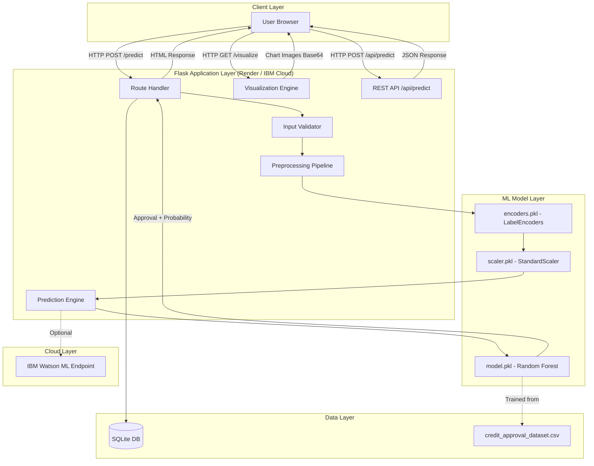
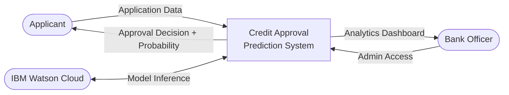
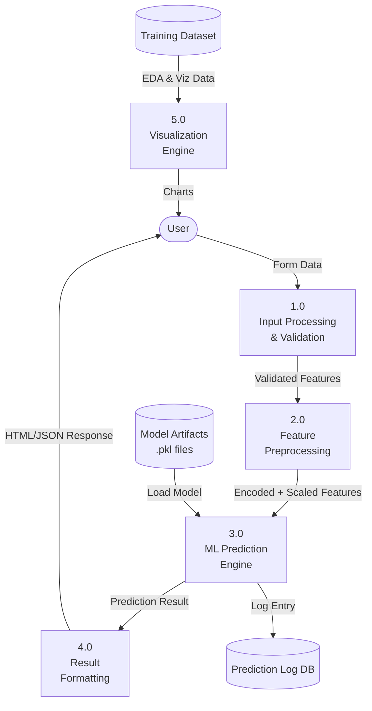
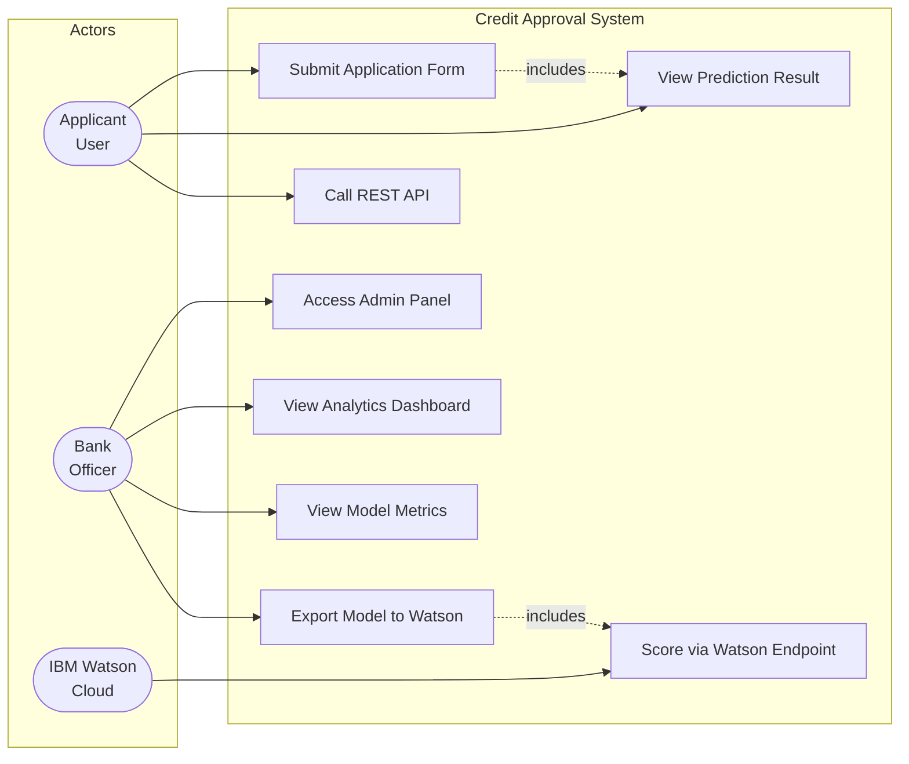
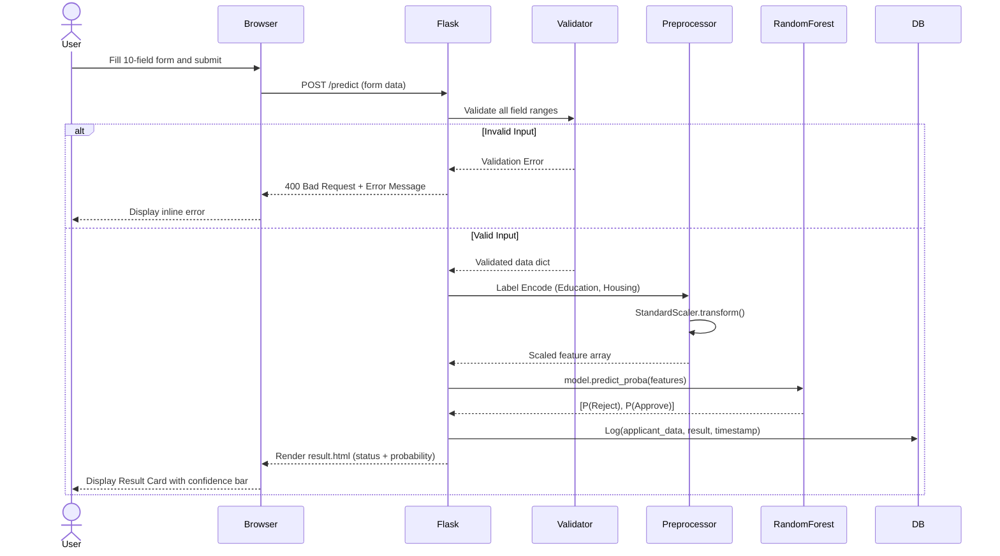
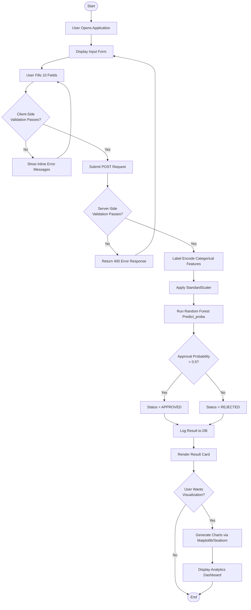
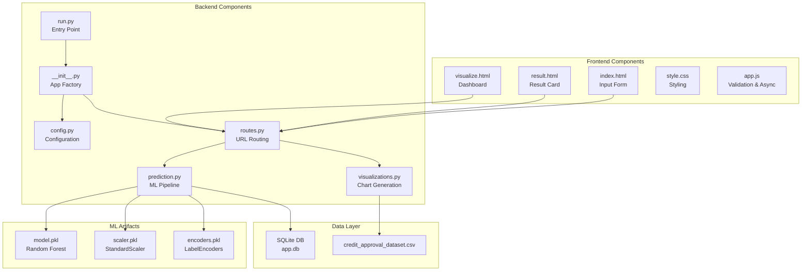
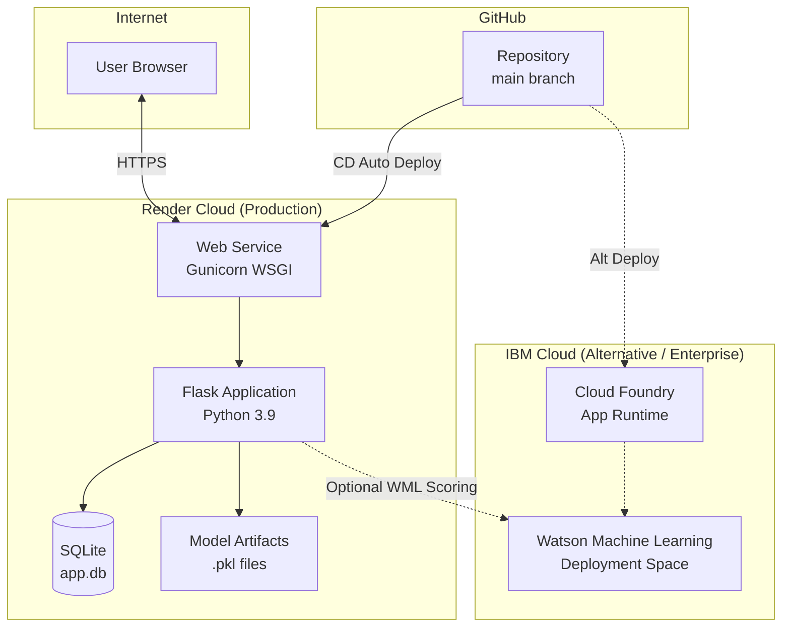
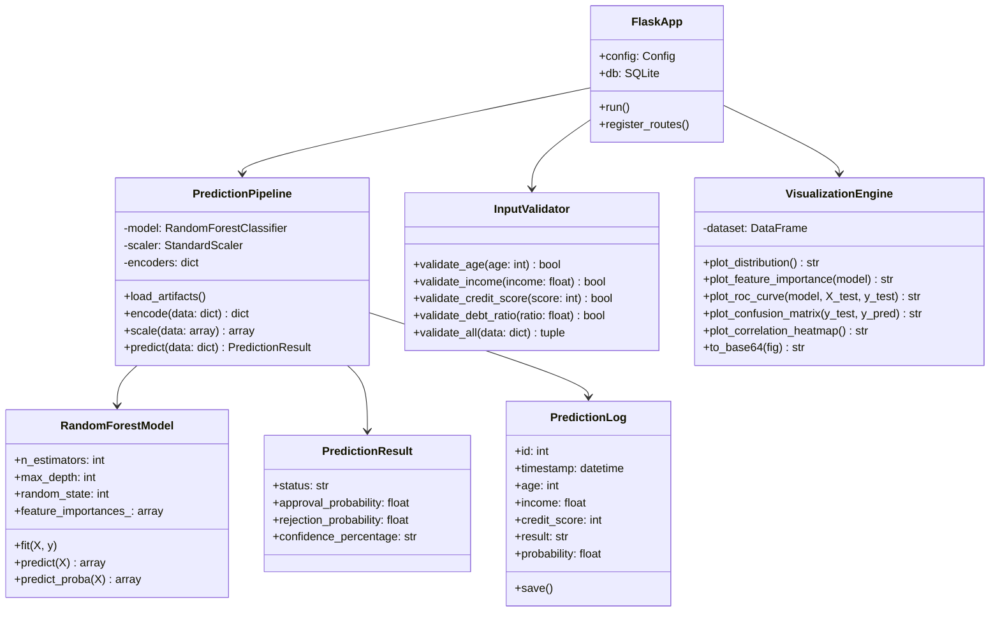
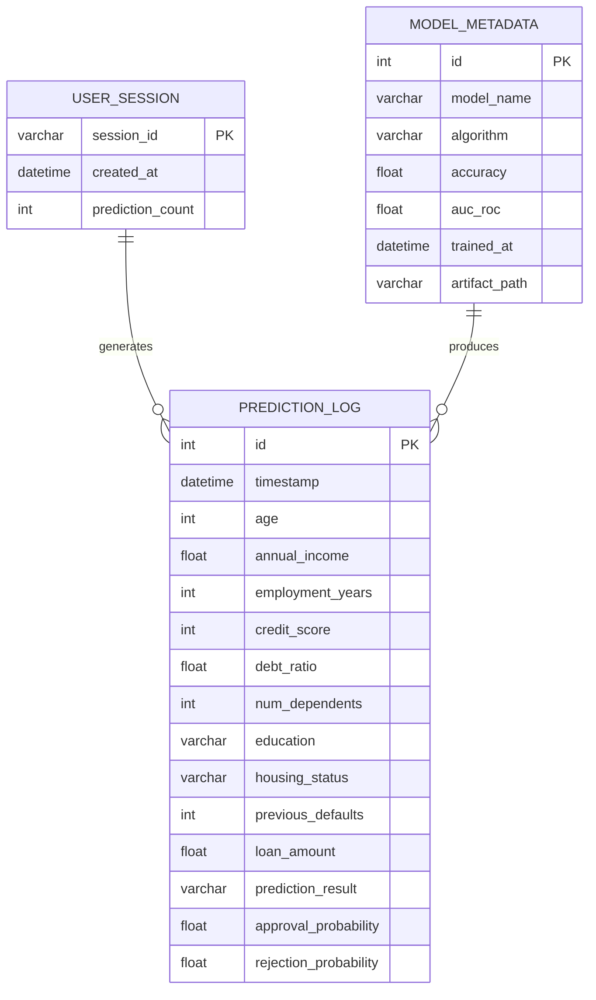

# Phase 3: Project Design

**Project:** AI-Based Credit Card Approval Prediction System
**Program:** SmartBridge Externship | AICTE | IBM SkillsBuild

---

## 3.1 System Architecture

The system follows a **three-tier web architecture** integrated with a **machine learning inference layer** and **cloud deployment**:

```
┌─────────────────────────────────────────────────────┐
│                  PRESENTATION TIER                  │
│    HTML5 · CSS3 · Bootstrap · JavaScript (ES6)      │
│         Input Form │ Result Card │ Dashboard        │
└──────────────────────┬──────────────────────────────┘
                       │ HTTP/HTTPS
┌──────────────────────▼──────────────────────────────┐
│                 APPLICATION TIER                    │
│              Flask 2.3.3 + Gunicorn                 │
│    Routes │ Validation │ Preprocessing │ API Layer  │
└──────────┬──────────────────────────┬───────────────┘
           │                          │
┌──────────▼──────────┐   ┌──────────▼───────────────┐
│    ML INFERENCE     │   │     DATA / STORAGE       │
│  Random Forest .pkl │   │  SQLite DB │ CSV Dataset │
│  Scaler.pkl         │   │  model.pkl │ scaler.pkl  │
│  Encoders.pkl       │   │  encoders.pkl            │
└──────────┬──────────┘   └──────────────────────────┘
           │ Optional
┌──────────▼──────────┐
│   IBM WATSON ML     │
│  Cloud Inference    │
│  Scoring Endpoint   │
└─────────────────────┘
```

---

## 3.2 Mermaid Architecture Diagram



---

## 3.3 Data Flow Diagram (DFD)

### DFD Level 0 — Context Diagram



### DFD Level 1 — System Processes



---

## 3.4 Use Case Diagram



---

## 3.5 Sequence Diagram



---

## 3.6 Activity Diagram



---

## 3.7 Component Diagram



---

## 3.8 Deployment Diagram



---

## 3.9 Class Diagram



---

## 3.10 ER Diagram



---

## 3.11 Database Design

### Table: prediction_log

| Column | Type | Constraints | Description |
|---|---|---|---|
| id | INTEGER | PRIMARY KEY, AUTOINCREMENT | Unique record identifier |
| timestamp | DATETIME | NOT NULL, DEFAULT NOW | When prediction was made |
| age | INTEGER | NOT NULL, CHECK(18–100) | Applicant age |
| annual_income | REAL | NOT NULL, CHECK(≥0) | Annual income in INR |
| employment_years | INTEGER | NOT NULL, CHECK(0–50) | Years employed |
| credit_score | INTEGER | NOT NULL, CHECK(300–850) | CIBIL credit score |
| debt_ratio | REAL | NOT NULL, CHECK(0.0–1.0) | Debt-to-income ratio |
| num_dependents | INTEGER | NOT NULL, CHECK(0–10) | Number of dependents |
| education | VARCHAR(20) | NOT NULL | Education level |
| housing_status | VARCHAR(20) | NOT NULL | Housing type |
| previous_defaults | INTEGER | NOT NULL, CHECK(0 OR 1) | Default history flag |
| loan_amount | REAL | NOT NULL, CHECK(≥0) | Requested loan amount |
| prediction_result | VARCHAR(10) | NOT NULL | "Approved" or "Rejected" |
| approval_probability | REAL | NOT NULL | P(Approval) from model |

---

## 3.12 UI/UX Design Specification

### Color Palette

| Element | Color | Hex Code |
|---|---|---|
| Primary Gradient Start | Purple | `#667eea` |
| Primary Gradient End | Deep Purple | `#764ba2` |
| Approved Status | Green | `#28a745` |
| Rejected Status | Red | `#dc3545` |
| Card Background | White | `#ffffff` |
| Body Background | Light Grey | `#f8f9fa` |
| Text Primary | Dark | `#2c3e50` |

### Responsive Breakpoints

| Breakpoint | Layout |
|---|---|
| ≥ 768px | Two-column (Form left, Result right) |
| < 768px | Single-column stack |

### Form Field Mapping

| Field | HTML Type | Validation |
|---|---|---|
| Age | `number` | min=18, max=100 |
| Annual Income | `number` | min=0, step=1000 |
| Employment Years | `number` | min=0, max=50 |
| Credit Score | `number` | min=300, max=850 |
| Debt Ratio | `number` | min=0.0, max=1.0, step=0.01 |
| Num Dependents | `number` | min=0, max=10 |
| Education | `select` | Dropdown (4 options) |
| Housing Status | `select` | Dropdown (4 options) |
| Previous Defaults | `select` | Yes / No |
| Loan Amount | `number` | min=0, step=500 |
