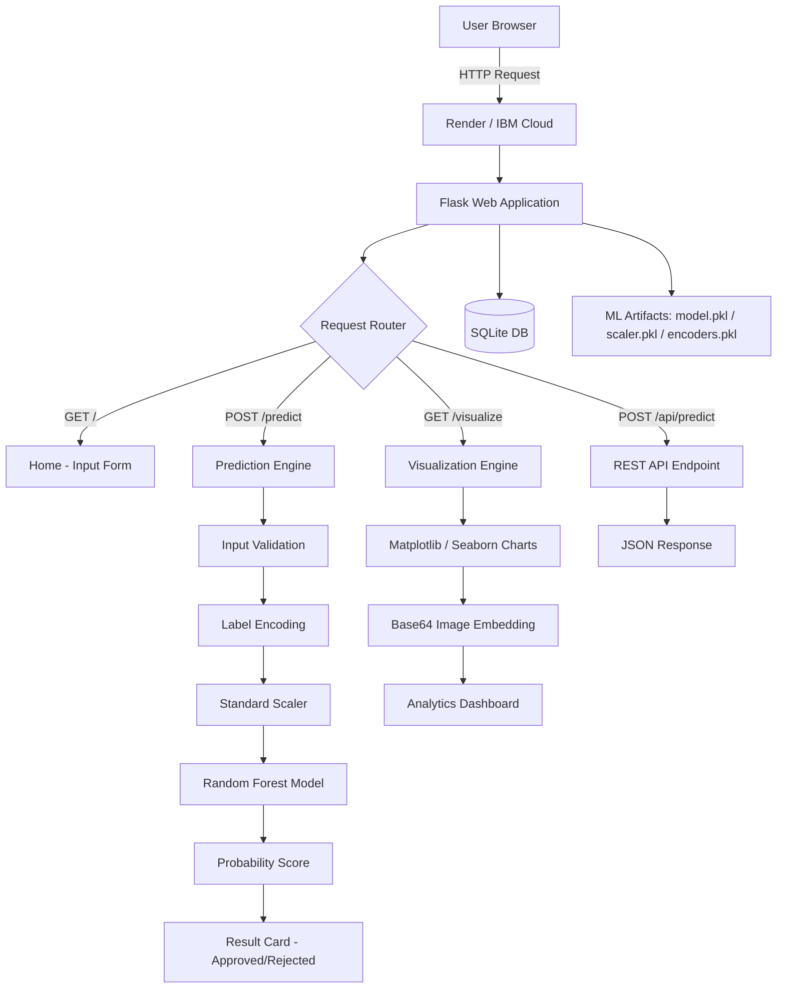
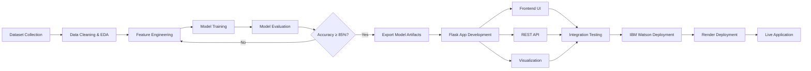

# AI-Based Credit Card Approval Prediction System

<div align="center">


**An intelligent, ML-powered web application that predicts credit card application outcomes in real time — reducing approval latency, eliminating manual bias, and enabling scalable, data-driven lending decisions.**

[Live Demo](#) · [Documentation](#project-documentation) · [Report a Bug](#) · [Request Feature](#)

</div>

---

## Table of Contents

1. [Project Overview](#1-project-overview)
2. [Features](#2-features)
3. [Technology Stack](#3-technology-stack)
4. [System Architecture](#4-system-architecture)
5. [Folder Structure](#5-folder-structure)
6. [Installation & Setup](#6-installation--setup)
7. [Environment Variables](#7-environment-variables)
8. [IBM Watson Configuration](#8-ibm-watson-configuration)
9. [Render Deployment](#9-render-deployment)
10. [Project Workflow](#10-project-workflow)
11. [Machine Learning Pipeline](#11-machine-learning-pipeline)
12. [API Reference](#12-api-reference)
13. [Screenshots](#13-screenshots)
14. [Future Enhancements](#14-future-enhancements)
15. [Contributors](#15-contributors)
16. [License](#16-license)
17. [Acknowledgements](#17-acknowledgements)

---

## 1. Project Overview

The **AI-Based Credit Card Approval Prediction System** is a production-ready machine learning web application developed as part of the **SmartBridge Externship Program** under **AICTE** and **IBM SkillsBuild**. It automates the credit card approval decision process using a trained **Random Forest Classifier** that analyzes ten applicant attributes to produce a real-time approval prediction with a confidence probability score.

Financial institutions process thousands of credit card applications daily. Traditional manual review is time-consuming, inconsistent, and susceptible to human bias. This system addresses that gap by:

- Automating approval decisions with **≥85% model accuracy**
- Providing **real-time predictions** in under 2 seconds
- Offering a **REST API** for banking system integration
- Enabling **visual analytics** for data-driven insights
- Supporting **IBM Watson** cloud deployment for enterprise scalability

### Domain
Artificial Intelligence · Machine Learning · Generative AI · FinTech

---

## 2. Features

| Feature | Description |
|---|---|
| **Real-Time Prediction** | Instant approval/rejection decision with probability confidence score |
| **10-Feature Input Form** | Responsive web form capturing all key applicant financial attributes |
| **REST API** | `/api/predict` endpoint returning structured JSON responses |
| **Data Visualization** | Feature importance charts, approval distribution, correlation heatmap, ROC curve |
| **Analytics Dashboard** | Visual breakdown of model performance metrics |
| **IBM Watson Integration** | Cloud-hosted model inference via Watson Machine Learning |
| **Render Deployment** | Publicly accessible live deployment on Render cloud |
| **Responsive UI** | Bootstrap-based mobile-first design with animated result cards |
| **Input Validation** | Client-side and server-side validation with meaningful error messages |
| **Model Artifacts Export** | `model.pkl`, `scaler.pkl`, `encoders.pkl` for portable deployment |

---

## 3. Technology Stack

### Frontend
| Technology | Version | Purpose |
|---|---|---|
| HTML5 | — | Page structure and semantic markup |
| CSS3 | — | Styling, animations, gradient themes |
| Bootstrap | 5.x | Responsive grid and UI components |
| JavaScript (ES6) | — | Form interactivity and async requests |

### Backend
| Technology | Version | Purpose |
|---|---|---|
| Python | 3.9+ | Core application language |
| Flask | 2.3.3 | Web framework and API routing |
| Gunicorn | 21.2.0 | WSGI production server |

### Machine Learning
| Technology | Version | Purpose |
|---|---|---|
| Scikit-Learn | 1.3.0 | Model training, preprocessing, evaluation |
| Pandas | 2.0.3 | Data loading, manipulation, EDA |
| NumPy | 1.24.3 | Numerical computation, array operations |
| Joblib / Pickle | — | Model serialization and persistence |

### Visualization
| Technology | Version | Purpose |
|---|---|---|
| Matplotlib | 3.7.2 | Static charts and figure generation |
| Seaborn | 0.12.2 | Statistical visualization and heatmaps |

### Database & Storage
| Technology | Purpose |
|---|---|
| SQLite | Lightweight relational database for application state |
| CSV (credit_approval_dataset.csv) | Training dataset storage |

### Cloud & Deployment
| Technology | Purpose |
|---|---|
| IBM Watson Machine Learning | Cloud model hosting and inference |
| IBM Cloud Foundry / Code Engine | Application runtime |
| Render | Primary public deployment platform |
| Git / GitHub | Version control and repository management |

---

## 4. System Architecture



### Architectural Layers

1. **Presentation Layer** — HTML5/CSS3/Bootstrap/JavaScript frontend served by Flask Jinja2 templates
2. **Application Layer** — Flask routes handling form submission, API calls, and visualization rendering
3. **Business Logic Layer** — Preprocessing pipeline (LabelEncoder → StandardScaler) feeding into the trained Random Forest Classifier
4. **Data Layer** — SQLite for application persistence; CSV dataset for training; Pickle files for model artifact storage
5. **Cloud Layer** — IBM Watson ML for enterprise inference; Render for public-facing deployment

---

## 5. Folder Structure

```
AI-Based-Credit-Card-Approval-Prediction-System/
│
├── app/                              # Main Flask application package
│   ├── __init__.py                   # Flask app factory and configuration
│   ├── routes.py                     # URL route definitions and view functions
│   ├── prediction.py                 # Prediction pipeline: encode → scale → predict
│   ├── visualizations.py             # Chart generation functions
│   ├── templates/                    # Jinja2 HTML templates
│   │   ├── base.html                 # Base layout with Bootstrap CDN
│   │   ├── index.html                # Main input form (10 applicant fields)
│   │   ├── result.html               # Prediction result card with confidence bar
│   │   └── visualize.html            # Analytics dashboard with charts
│   └── static/                       # Static assets
│       ├── css/
│       │   └── style.css             # Custom styles, gradients, animations
│       └── js/
│           └── app.js                # Form validation and async interactions
│
├── ml_models/                        # Trained model artifacts
│   ├── model.pkl                     # Serialized Random Forest Classifier
│   ├── scaler.pkl                    # Fitted StandardScaler instance
│   └── encoders.pkl                  # Label encoders for Education & Housing
│
├── instance/                         # Flask instance folder (gitignored)
│   └── app.db                        # SQLite database file
│
├── tests/                            # Test suite
│   ├── test_routes.py                # Unit tests for Flask routes
│   ├── test_prediction.py            # Unit tests for ML pipeline
│   └── test_api.py                   # Integration tests for REST API
│
├── docs/                             # Project documentation assets
│   ├── diagrams/                     # Architecture and UML diagrams
│   ├── screenshots/                  # Application UI screenshots
│   ├── report/                       # Engineering project report (PDF)
│   └── presentation/                 # Demo slides and viva prep
│
├── SmartBridge-Documentation/        # Complete SmartBridge deliverable set
│   ├── 1. Brainstorming_Ideation.md
│   ├── 2. Requirement_Analysis.md
│   ├── 3. Project_Design.md
│   ├── 4. Project_Planning.md
│   ├── 5. Project_Development.md
│   ├── 6. Project_Testing.md
│   ├── 7. Project_Documentation.md
│   └── 8. Project_Demonstration.md
│
├── model_training.ipynb              # Jupyter Notebook: full ML pipeline
├── credit_approval_dataset.csv       # Training dataset (3000+ records)
├── requirements.txt                  # Python dependencies
├── config.py                         # Flask configuration (dev/prod)
├── run.py                            # Application entry point
├── Procfile                          # Render/Heroku process definition
├── render.yaml                       # Render deployment configuration
├── .gitignore                        # Git exclusion rules
└── README.md                         # This file
```

---

## 6. Installation & Setup

### Prerequisites
- Python 3.9 or higher
- pip package manager
- Git
- (Optional) IBM Cloud account for Watson ML integration

### Step-by-Step Local Setup

**1. Clone the repository**
```bash
git clone https://github.com/<your-username>/AI-Based-Credit-Card-Approval-Prediction-System.git
cd AI-Based-Credit-Card-Approval-Prediction-System
```

**2. Create and activate a virtual environment**
```bash
# Windows
python -m venv venv
venv\Scripts\activate

# macOS / Linux
python3 -m venv venv
source venv/bin/activate
```

**3. Install dependencies**
```bash
pip install -r requirements.txt
```

**4. Train the model (or use pre-trained artifacts)**
```bash
# Open and run all cells in the Jupyter Notebook
jupyter notebook model_training.ipynb

# This generates: ml_models/model.pkl, ml_models/scaler.pkl, ml_models/encoders.pkl
```

**5. Configure environment variables**
```bash
cp .env.example .env
# Edit .env with your IBM Watson credentials (see Section 7)
```

**6. Initialize the database**
```bash
flask db init
flask db migrate
flask db upgrade
```

**7. Run the application**
```bash
python run.py
```

**8. Access the application**
```
http://localhost:5000
```

---

## 7. Environment Variables

Create a `.env` file in the project root with the following variables:

```env
# Flask Configuration
FLASK_APP=run.py
FLASK_ENV=development
SECRET_KEY=your-secret-key-here

# IBM Watson Machine Learning
IBM_API_KEY=your-ibm-cloud-api-key
IBM_SERVICE_URL=https://us-south.ml.cloud.ibm.com
IBM_DEPLOYMENT_ID=your-deployment-id
IBM_SPACE_ID=your-space-id

# Database
DATABASE_URL=sqlite:///instance/app.db

# Model Paths
MODEL_PATH=ml_models/model.pkl
SCALER_PATH=ml_models/scaler.pkl
ENCODER_PATH=ml_models/encoders.pkl
```

> **Security Note:** Never commit `.env` to version control. Add it to `.gitignore`.

---

## 8. IBM Watson Configuration

### Setup Steps

1. **Create IBM Cloud Account** — [cloud.ibm.com](https://cloud.ibm.com)
2. **Provision Watson Machine Learning** — Search "Machine Learning" in IBM Cloud catalog and create a Lite plan instance
3. **Create a Deployment Space** — Navigate to Watson Studio → Deployment Spaces → New Space
4. **Upload Model Artifact**
   ```python
   from ibm_watson_machine_learning import APIClient
   
   wml_credentials = {
       "apikey": "YOUR_API_KEY",
       "url": "https://us-south.ml.cloud.ibm.com"
   }
   client = APIClient(wml_credentials)
   client.set.default_space("YOUR_SPACE_ID")
   
   # Store the model
   model_details = client.repository.store_model(
       model="ml_models/model.pkl",
       meta_props={
           client.repository.ModelMetaNames.NAME: "CreditApprovalRF",
           client.repository.ModelMetaNames.TYPE: "scikit-learn_1.3",
           client.repository.ModelMetaNames.SOFTWARE_SPEC_UID: sw_spec_uid
       }
   )
   ```
5. **Deploy and get Deployment ID** — IBM Watson UI → Deployments → Create Online Deployment
6. **Update `.env`** with your `IBM_DEPLOYMENT_ID` and `IBM_SPACE_ID`

### Watson Inference Call (Python)
```python
scoring_payload = {
    "input_data": [{
        "fields": ["Age","Income","Employment_Years","Credit_Score",
                   "Debt_Ratio","Num_Dependents","Previous_Defaults",
                   "Loan_Amount","Education_Encoded","Housing_Encoded"],
        "values": [[35, 60000, 5, 720, 0.25, 2, 0, 15000, 1, 0]]
    }]
}
predictions = client.deployments.score(deployment_id, scoring_payload)
```

---

## 9. Render Deployment

### Automatic Deployment from GitHub

1. Go to [render.com](https://render.com) and sign in
2. Click **New → Web Service**
3. Connect your GitHub repository
4. Configure the service:

| Setting | Value |
|---|---|
| **Environment** | Python 3 |
| **Build Command** | `pip install -r requirements.txt` |
| **Start Command** | `gunicorn run:app` |
| **Instance Type** | Free |

5. Add environment variables from Section 7 in the Render Dashboard → Environment
6. Click **Create Web Service**

### `render.yaml` (Infrastructure as Code)
```yaml
services:
  - type: web
    name: credit-approval-system
    env: python
    buildCommand: pip install -r requirements.txt
    startCommand: gunicorn run:app
    envVars:
      - key: SECRET_KEY
        generateValue: true
      - key: FLASK_ENV
        value: production
```

### `Procfile`
```
web: gunicorn run:app
```

---

## 10. Project Workflow



---

## 11. Machine Learning Pipeline

### Dataset
- **Source:** Synthetic credit approval dataset
- **Records:** 3,000+ labeled entries
- **Features:** 10 input variables + 1 binary target
- **Class Balance:** Approximately 50/50 (Approved / Rejected)

### Features

| Feature | Type | Range / Values |
|---|---|---|
| Age | Numeric | 18–100 |
| Annual Income | Numeric | ₹0–₹10,000,000 |
| Employment Years | Numeric | 0–50 |
| Credit Score | Numeric | 300–850 |
| Debt Ratio | Numeric | 0.0–1.0 |
| Number of Dependents | Numeric | 0–10 |
| Education Level | Categorical | High School / Bachelor / Master / PhD |
| Housing Status | Categorical | Rent / Own / Mortgage / Other |
| Previous Defaults | Binary | 0 (No) / 1 (Yes) |
| Loan Amount | Numeric | ₹0–₹5,000,000 |

### Preprocessing Pipeline
```
Raw Input → Label Encoding (Education, Housing) → StandardScaler → Random Forest
```

### Models Trained

| Model | Accuracy | AUC-ROC | Status |
|---|---|---|---|
| Random Forest Classifier | **88.83%** | **0.94** | ✅ Primary |
| Logistic Regression | ~82% | ~0.88 | Baseline |

### Model Configuration (Random Forest)
```python
RandomForestClassifier(
    n_estimators=200,
    max_depth=10,
    random_state=42
)
```

### Key Feature Importances (Approximate Ranking)
1. Credit Score
2. Income
3. Debt Ratio
4. Previous Defaults
5. Employment Years

---

## 12. API Reference

### POST `/api/predict`

**Request:**
```json
{
  "age": 35,
  "income": 60000,
  "employment_years": 5,
  "credit_score": 720,
  "debt_ratio": 0.25,
  "num_dependents": 2,
  "education": "Bachelor",
  "housing": "Rent",
  "previous_defaults": 0,
  "loan_amount": 15000
}
```

**Response (Approved):**
```json
{
  "status": "Approved",
  "approval_probability": 0.9234,
  "rejection_probability": 0.0766,
  "confidence": "92.34%"
}
```

**Response (Rejected):**
```json
{
  "status": "Rejected",
  "approval_probability": 0.1842,
  "rejection_probability": 0.8158,
  "confidence": "81.58%"
}
```

**Error Response:**
```json
{
  "error": "Invalid input: credit_score must be between 300 and 850",
  "status": 400
}
```

---

## 13. Screenshots

> Screenshots are located in `docs/screenshots/`. Add the following images after capturing from the live application:

| Screenshot | File |
|---|---|
| Home Page – Input Form | `docs/screenshots/01_home_form.png` |
| Approved Result Card | `docs/screenshots/02_result_approved.png` |
| Rejected Result Card | `docs/screenshots/03_result_rejected.png` |
| Analytics Dashboard | `docs/screenshots/04_dashboard.png` |
| Feature Importance Chart | `docs/screenshots/05_feature_importance.png` |
| Confusion Matrix | `docs/screenshots/06_confusion_matrix.png` |
| ROC Curve | `docs/screenshots/07_roc_curve.png` |
| Mobile View | `docs/screenshots/08_mobile_view.png` |

---

## 14. Future Enhancements

| Priority | Enhancement | Description |
|---|---|---|
| High | Explainability (SHAP) | Integrate SHAP values to explain individual predictions |
| High | User Authentication | Secure login system for applicants and bank officers |
| High | Database Logging | Store all predictions in SQLite for audit trails |
| Medium | Model Retraining Pipeline | Auto-retrain on new data batches via scheduled jobs |
| Medium | Multi-Model Ensemble | Combine RF + XGBoost + LightGBM for improved accuracy |
| Medium | Fairness Audit | Bias detection across age, gender, and education groups |
| Low | Email Notifications | Auto-send approval/rejection status to applicants |
| Low | Multilingual Support | Hindi and regional language UI |
| Low | Mobile App (Flutter) | Cross-platform native mobile application |
| Low | Blockchain Audit Log | Immutable record of all prediction decisions |

---

## 15. Contributors

| Name | Role | Responsibilities |
|---|---|---|
| **SK Alfhi** | Application Builder & Frontend Developer | Flask Development, UI Design, ML Integration, IBM Watson, GitHub, Render, Documentation |
| **SK Rabbani** | Machine Learning Engineer | Dataset Cleaning, Feature Engineering, Model Training, Hyperparameter Tuning, Model Evaluation |
| **Bheemuni Pujitha** | Team Lead · Data Analyst · Visualization Engineer | Team Coordination, EDA, Data Visualization, Reporting, Documentation Review |
| **Darla Krishna** | Data Collection Specialist | Dataset Collection, Verification, Missing Value Analysis, Data Preparation |
| **Modugumudi TwineMallikadevi** | Testing & QA Engineer | Functional, Integration & UI Testing, Bug Reporting, Validation |

---

## 16. License

This project is licensed under the **MIT License**. See the [LICENSE](LICENSE) file for details.

```
MIT License

Copyright (c) 2025 SK Alfhi, SK Rabbani, Bheemuni Pujitha, Darla Krishna, Modugumudi TwineMallikadevi

Permission is hereby granted, free of charge, to any person obtaining a copy of this software...
```

---

## 17. Acknowledgements

- **SmartBridge** — For designing and delivering this externship program
- **IBM SkillsBuild** — For providing cloud infrastructure and learning resources
- **AICTE** — For recognizing and certifying this internship
- **Scikit-Learn Community** — For the robust ML toolkit
- **Flask Community** — For the lightweight and powerful web framework
- **Render** — For free-tier hosting enabling live deployment
- **Kaggle / UCI ML Repository** — For inspiration on credit dataset structure

---

<div align="center">

**SmartBridge Externship 2025 | AICTE | IBM SkillsBuild**

*Built with Python, Flask, Scikit-Learn, and IBM Watson*

</div>
